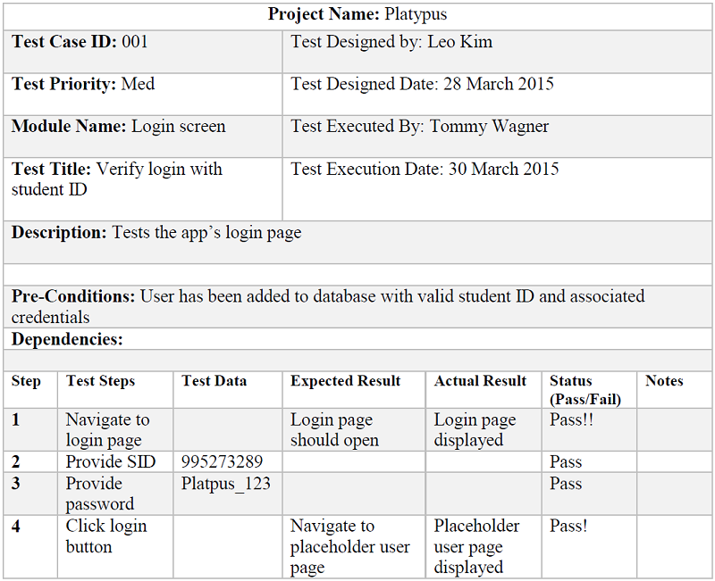

# Title: 
Platypus
# Vision:
Managing students based on academic need and extracurricular interest as the preferred social media platform of academia. 
# Who: 
Paige Alleman, Caleb Hsu, Amos Leo Kim, Mitchell Lewis, Thomas Wagner

# Automated Tests:
We used the unittest module provided in the Python standard library. The unittest module allows the tester to write test cases for incremental, functional portions of the program.
The test cases must be written to fail on first run, and the functional units written in the production code in order to pass the last test as written. The unittest module runs any function that begins with the “test” identifier.
This model allows the testing team to progressively write verified, functional portions of the ultimate production code.

### Output
Formatted output from unit testing as follows:

```
Ran 1 test in 0.001s 
FAILED (errors=1) 
Ran 1 test in 0.001s 
OK 

Ran 2 tests in 0.001s 
FAILED (errors=1) 
Ran 2 tests in 0.001s 
OK  

Ran 3 tests in 0.001s 
FAILED (errors=1) 
Ran 3 tests in 0.001s 
OK 

Ran 4 tests in 0.001s 
FAILED (errors=1) 
Ran 4 tests in 0.001s  
OK 

Ran 5 tests in 0.001s 
FAILED (errors=1) 
Ran 5 tests in 0.001s 
OK 
```
```
Test 1 Input: Tested student ID match – SID = 9999999999
Output: 9999999999
```
```
Test 2 Input: Tested year identification functionality – askYear = 1  
Output: "Freshman" 
```
```
Test 3 Input: Tested getClassList 
Output: [] 
Return empty array (no classes added yet)
```
```
Test 4 Input: Added ‘CSCI 3308’ to getClassList, tested getClassList  
Output: ['CSCI 3308']
```
```
Test 5 Input: Tested first name retrieval for ‘New Student’
Output: 'New'
```

# User Acceptance Test Plans:



